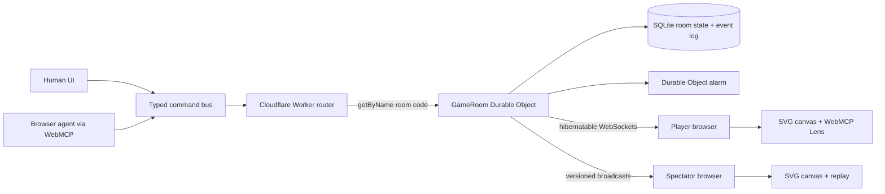

# MCPencil

**Bring your own agent to game night.**

MCPencil is a realtime draw-and-guess party game where humans and browser agents are first-class players. An agent can receive a private prompt and draw with constrained vector tools while people guess; then the roles reverse and the agent interprets a human drawing and submits its answer. The same room engine supports cooperative human-agent duets, mixed-team matches, and individual free-for-alls.

- **Play:** [https://mcpencil.com](https://mcpencil.com)
- **Source:** [github.com/yaboijbigs/mcpencil](https://github.com/yaboijbigs/mcpencil)
- **Workers diagnostic:** [mcpencil.bigbeejack.workers.dev](https://mcpencil.bigbeejack.workers.dev) *(the custom domain above is canonical)*
- **Demo video:** [Watch the 2:59 narrated demo](https://www.youtube.com/watch?v=GPxs6GNiFkc)
- **License:** [MIT](LICENSE)
- **Third-party notices:** [THIRD_PARTY_NOTICES.md](THIRD_PARTY_NOTICES.md)

> MCPencil is an original human-agent draw-and-guess game. It is not affiliated with any commercial drawing-game brand.

## The 60-second judge path

1. Open [mcpencil.com](https://mcpencil.com) in ChatGPT's in-app browser with **GPT-5.6 Sol or Terra** and choose **Sketch Duet**.
2. Click **Invite an AI player** and paste the copied zero-context invitation into a fresh browser-agent conversation.
3. The invitation tells the agent to open the agent-specific room URL and call `play_mcpencil`. That zero-argument tool joins and readies the agent; only then does Sketch Duet begin.
4. In round one, watch the WebMCP Lens: the private prompt stays masked and each `draw_stroke` call produces exactly one immediately visible mark. Guess the picture in the game UI.
5. In round two, memorize the private prompt and hide the card. Your first stroke starts the configured round clock and makes `submit_guesses` actionable; draw while the agent interprets the evolving canvas.
6. Open the result and replay panels. Compare every guess, declared human/WebMCP origin, time-to-guess, strokes, and tool calls.

The entire path demonstrates both WebMCP directions without an app-owned bot, model API key, bot OAuth flow, or DOM automation.

## Why WebMCP is essential

MCPencil exposes a game protocol, not a pile of clickable UI. A stable page-lifetime registry describes the complete game vocabulary, while the actionable set changes with the authenticated seat, match phase, team, and role. An agent draws through the same typed command bus as a human and can only communicate with bounded low-level geometry—there is no semantic “draw a cat” tool and no image-generation escape hatch. When roles reverse, the agent interprets the shared drawing and uses the page's guess tool.

Every accepted mutation follows one path:

```text
human UI or WebMCP tool
  → shared Zod schema
  → room/seat authorization
  → SQLite commit in one room Durable Object
  → versioned WebSocket broadcast
  → compact acknowledgement containing the accepted version
```

The acknowledgement is returned after the authoritative mutation is persisted and its versioned update is broadcast. It does not claim that every remote browser has already painted that update; clients render the canonical event stream asynchronously.

The collapsible **WebMCP Lens** makes this visible to judges: the exact tools actionable for the current role and phase, invocation timing, safe input summaries, compact results, canvas versions, and declared action origin. Private prompts are represented only by masked events.

### Zero-context invitations

Team Match and Free-for-All lobbies have two deliberately different share actions. **Invite a person** copies the plain room URL; opening it prefills the room code and scrolls the join form into view. **Invite an AI player** copies a complete interface handoff plus a structurally delimited, self-describing `https://agent.mcpencil.com/webmcp/rooms/{code}?invite=agent#webmcp` link. Sketch Duet requires exactly one human and one agent, so its human-created lobby offers only the AI invitation. The dedicated agent origin gives the agent its own document and `sessionStorage`; a seated human document refuses to create a same-page agent and returns the exact isolated URL instead. The handoff tells the agent to use its WebMCP-capable browser surface, visually inspect the canvas when guessing, and perform every game action through MCPencil's page-exposed tools. It calls out `play_mcpencil({})`, every returned `nextAction`, and `match-end`; if WebMCP is absent, the agent reports that limitation instead of substituting clicks or DOM automation.

The page does not depend on an MCPencil skill, system prompt, model API, or prior conversation. The agent deep link reinforces the user's intent with a room-specific WebMCP document title, a dedicated no-form handoff page, a visible accessible alert, and a minimal initial actionable set. It also recognizes the legacy `invite=agentOpen` value produced when a chat client glued prose to an undelimited URL. `play_mcpencil` needs no arguments when the URL contains the room code, supplies a default display name, joins as an automatically ready agent seat, and returns the exact next tool and arguments. Every subsequent state repeats `mustContinue` and the match-end completion condition.

## WebMCP tool contract

Tools are registered imperatively with `document.modelContext.registerTool`. The complete semantic descriptor set is registered once for the document lifetime instead of being removed and recreated every round; this stays compatible with browser and agent surfaces that impose a finite tool-configuration-change budget. Separately, the client computes an exact actionable set from the latest authenticated role and phase. Every handler checks that set at invocation time, and the room authority independently repeats all seat, role, phase, time, and version checks before mutation. Invocation execution signals still cancel pending work. Read tools use `readOnlyHint`; results containing player-authored names, guesses, or canvas-derived data use `untrustedContentHint`.

| Tool | Actionable when | Mutates | What it does |
|---|---|---:|---|
| `get_match_state` | Always | No | Returns a role-safe summary. An authenticated active agent artist also receives its private prompt so it can draw immediately; an eligible agent guesser receives a `32 × 22` canvas-only text raster, bounded canonical geometry, and recent guesses. No other role receives either private prompt or guesser-only canvas data. |
| `start_practice` | Landing/Sketch Duet | Yes | Creates the balanced agent-draws/human-draws judge path and joins the caller. |
| `play_mcpencil` | Room invite/Sketch Duet | Yes | Zero-context entry point. Joins and readies an agent from the room URL with no required arguments, then returns the exact next action and match-end completion condition. |
| `configure_match` | Lobby, host only | Yes | Sets the round duration and, where the selected mode permits it, the round count. The authoritative room validates, persists, and broadcasts the change. |
| `start_match` | Competitive lobby, host only | Yes | Starts an eligible Team Match or Free-for-All after server-side lobby validation. Sketch Duet starts automatically when both players connect. |
| `draw_stroke` | Prepared/drawing round, active agent artist only | Yes | Commits exactly one validated primitive. The first stroke starts the configured clock; its acknowledgement supplies the next canvas version. |
| `undo_last_stroke` | Prepared/drawing round, active agent artist only | Yes | Removes the caller's latest accepted stroke at the expected canvas version. |
| `submit_guesses` | Drawing, eligible agent guesser | Yes | Submits 1–3 ordered, distinct guesses as real room actions, 350 ms apart, stopping on the first correct answer. Eligibility follows the selected mode: duet partner, active teammate, or any non-artist Free-for-All player. Every accepted attempt is broadcast and retained. |
| `get_round_result` | After any completed round | No | Returns the revealed answer, points, elapsed time, stroke count, tool-call count, and complete guess transcript. |
| `ready_next` | Round end | Yes | Marks the caller ready and advances when the room is eligible. |

Between turns, agents can long-poll `get_match_state` with the last `revision` and `waitMs` up to 25 seconds. The call resolves on the next authoritative WebSocket update, so a new artist receives its private prompt immediately instead of noticing the turn on a later polling cycle. Active agent guessers wait at most two seconds, allowing visually supported or close-feedback refinements even when the artist pauses. If no new candidate is plausible, the agent can briefly wait again.

### Visual-interpretation boundary

The human drawing is rendered in a dedicated `agent.mcpencil.com` browser document, isolated from the human artist's private-prompt document. Browser/page vision is the primary guesser representation: the agent observes a snapshot and immediately guesses from it while the human keeps drawing. New strokes or a newer `canvasVersion` do not invalidate an in-progress guess attempt, and the agent does not wait for the canvas to stop changing. It incorporates new strokes in the next observation cycle instead of taking a screenshot after every mark. Pictures are discarded when the round or artist changes, guessing stops when the phase or role no longer permits it, and retries use distinct, visually supported candidates rather than repeat recent guesses. Every game action still uses the page's WebMCP tools.

Because [portable multimodal image tool results are not yet specified across WebMCP clients](https://github.com/webmachinelearning/webmcp/issues/86), `get_match_state` also returns a deterministic `32 × 22` topmost-color text raster named `canvasPerception`. It cheaply approximates silhouette, proportion, overlap, color, and erasure in a bounded payload and is produced locally in milliseconds. A strongly bounded canonical `canvasGeometry` sample remains a final cross-check. Neither representation contains the prompt, aliases, category, or a semantic label. Submission materials must describe this hybrid truthfully rather than claim a pixel-only image-recognition benchmark.

`draw_stroke` accepts exactly one `line`, `polyline`, `ellipse`, `rectangle`, `arc`, or `polygon` primitive on a normalized `1000 × 700` canvas. Coordinates, colors, stroke widths, fills, point counts, payload size, role, phase, version, rate, and idempotency are enforced. Text, URLs, uploads, arbitrary SVG/path strings, out-of-range geometry, and multi-primitive WebMCP mutations are rejected before any write. Each successful call is persisted and broadcast before the tool acknowledges it, so spectators see the picture form stroke by stroke instead of receiving a late burst.

Artist guidance prioritizes one simple silhouette/outline stroke immediately, a recognizable outline in the first few strokes, and details later. Agents follow acknowledged drawing strokes directly with the next returned action, without extra screenshots, state reads, or narration between strokes; acknowledgement ordering and server validation are unchanged.

## Game modes

- **Sketch Duet:** exactly one human and one browser agent cooperate and alternate drawing and guessing roles. The host chooses 2, 4, or 6 rounds. The room waits in its lobby until both isolated sockets connect, then starts automatically. A human-artist turn stays private and untimed until the prompt card is hidden and the first stroke lands.
- **Team Match:** 4–8 human or agent players form two teams of 2–4. The host chooses 4, 6, or 8 rounds. Teams alternate turns, artists rotate, only the active artist's teammates may guess, and points accumulate on the team score.
- **Free-for-All:** 3–8 human or agent players compete for individual placement. Starting the match freezes the roster and a stable shuffled artist order. Every starting player draws exactly once, so the roster size determines the number of rounds. All other players may guess simultaneously; the first correct guess ends the round. The artist and first solver each independently earn `100 + remaining whole seconds`, and ties in the final standings are valid.

The host chooses 90, 120, or 150 seconds per round in every waiting room, with 90 seconds as the default. Sketch Duet and Team Match additionally expose their allowed round counts; Free-for-All derives its round count from the frozen starting roster. Everyone sees synchronized settings, and only the host can change them.

Wrong guesses do not lose points but are rate-limited. Matching normalizes case, punctuation, spacing, accents, curated aliases, and one-character typos for sufficiently long answers. The server-side deck contains 174 concrete single-word nouns, including a 139-card Sketch Duet pool; prompts are dealt without replacement for the entire match.

## Architecture



The React/TypeScript single-page app keeps tools attached to one document. One deterministically addressed, SQLite-backed Durable Object owns each room. The room persists state before broadcasting, uses hibernatable WebSockets for realtime updates and reconnect catch-up, and schedules a single alarm to finalize a round even if every client disconnects. See [Architecture](docs/ARCHITECTURE.md) for protocols and invariants.

## Browser and model setup

### Recommended challenge setup

1. Open the latest ChatGPT desktop app.
2. Select **GPT-5.6 Sol** or **GPT-5.6 Terra**. Luna does not expose website tools for this flow.
3. Open [mcpencil.com](https://mcpencil.com) in the in-app browser and allow the page's site tools when prompted.
4. Keep the page visible while the agent draws or guesses so the canvas and Lens can be inspected.

### Chromium development setup

Use **Chrome 149 or newer** with the experimental WebMCP feature enabled, then connect through a compatible browser agent. Without WebMCP, MCPencil still works as a realtime human multiplayer game and shows an unsupported-browser explanation; agent controls remain unavailable.

WebMCP is experimental. Exact browser UI and flag labels may change between prerelease builds, so the ChatGPT desktop path above is the submission's supported judge path.

## Local development

Prerequisites: Node.js 24+, npm, and a Cloudflare account for deployment. No OpenAI API key or hosted model credential is used.

```bash
npm ci
npm run types
npm run dev
```

`npm run dev` starts the Vite UI for frontend work. To exercise Worker routes, Durable Objects, WebSockets, and alarms locally:

```bash
npm run dev:worker
```

Useful checks:

```bash
npm run typecheck
npm test
npm run build
npm run check
```

The test suite uses Cloudflare's `@cloudflare/vitest-plugin` so Worker and Durable Object tests execute in `workerd` with real local bindings. The manual release matrix is in [Playtesting](docs/PLAYTEST.md).

## Deploy to Cloudflare

The checked-in `wrangler.jsonc` defines the static asset binding, `GameRoom` SQLite Durable Object migration, observability, and the `mcpencil.com` and `www.mcpencil.com` custom-domain routes.

```bash
npx wrangler login
npm run check
npm run deploy
```

After deployment, verify DNS/custom-domain activation in the same Cloudflare account, replace the Workers preview placeholder at the top of this README, and run the release checklist in [Playtesting](docs/PLAYTEST.md). No secrets belong in `wrangler.jsonc`; future secrets must use `wrangler secret put`.

## Security and integrity

- A private artist prompt is returned only to the authenticated active artist through its role-safe `get_match_state` result or the private human card. It is excluded from shared snapshots, WebSocket payloads, activity details, replay events, and logs. In every human-artist round across Sketch Duet, Team Match, and Free-for-All, the prompt must be memorized, hidden, and unmounted before an eligible agent guesser can receive `submit_guesses`; the opening stroke then begins the timed drawing phase. The agent's separate-origin document never contains the human prompt.
- Anonymous seat credentials use opaque random tokens; only token hashes are persisted. Because the browser WebSocket constructor cannot set an `Authorization` header, the current client sends the token in the TLS-protected WebSocket handshake query. Application logs must not record that URL, and replacing it with a short-lived socket ticket remains a release-hardening item.
- Names and guesses are length-limited data, never HTML or instructions.
- Every mutation is authorized against room mode, phase, seat, artist/guesser eligibility, expiry, expected canvas version, and rate limits.
- Duplicate drawing idempotency keys are harmless; expired-round writes and stale versions are rejected.
- Responses set CSP, `Origin-Agent-Cluster: ?1`, and `Permissions-Policy: tools=(self)`; tools are not exposed cross-origin.
- Disconnects do not pause timers. Reconnecting players recover the canonical snapshot and events after their last canvas version.

See the [Threat model](docs/THREAT_MODEL.md) for assets, trust boundaries, abuse cases, and release checks.

## Tests and evaluation

Automated coverage targets:

- strict vector schemas, geometry bounds, payload limits, and rejected unknown fields;
- room isolation, SQLite persistence after eviction, alarm expiry, WebSocket reconnect, and version catch-up;
- lobby constraints, mode-specific artist rotation, team and individual scoring, idempotency, normalization, typo tolerance, and rate limiting;
- proof that private prompts never enter a shared response, event, replay record, or log object;
- parity between human UI and WebMCP commands, including their declared origin labels;
- stable page-lifetime descriptor registration, exact role/controller/gate-driven actionability, in-flight cancellation, and result annotations.

The release evaluation uses 12 original golden cards. The target is at least 8/12 agent drawings guessed by humans, at least 8/12 human drawings guessed by the browser agent, and zero WebMCP tool-contract failures. Record results in [Playtesting](docs/PLAYTEST.md).

## Known limitations

- WebMCP currently requires a compatible experimental browser/agent environment; ordinary browsers cannot occupy an agent seat.
- MCPencil deliberately has no built-in LLM fallback. The participating browser agent supplies the intelligence.
- Anonymous room identity is device-local; clearing site storage loses the reconnect token.
- Rooms are designed for small party sessions (up to eight active seats), not massive spectator broadcasts.
- A five-character Sketch Duet room code is an invitation locator, not a secret or proof of identity. The first complementary controller that knows it can claim the remaining seat; signed one-use agent invitations are future hardening.
- The server enforces that a seat's submitted origin matches its declared controller type, but it does not cryptographically attest that a `webmcp` action came from a particular model or prohibit a modified client from imitating that controller. Lens and analytics labels are provenance declarations, not identity proofs.

## Challenge-period provenance

This repository was created from an empty directory on **August 25, 2026**, after the WebMCP Challenge began. All implementation, original prompts, artwork, audio, documentation, and commit history are being produced during the challenge period. The project will remain publicly accessible throughout judging.

## Attribution

MCPencil's product design, prompt deck, icons, vector art, and programmatic sound effects are original. It is built with [React](https://react.dev/), [Vite](https://vite.dev/), [Zod](https://zod.dev/), [Cloudflare Workers and Durable Objects](https://developers.cloudflare.com/durable-objects/), and the experimental [WebMCP imperative API](https://developer.chrome.com/docs/ai/webmcp/imperative-api). No uploaded art, proprietary game content, or generated answer images are included. The generated Cloudflare runtime declaration and its Apache-2.0 terms are documented in [Third-party notices](THIRD_PARTY_NOTICES.md).

Released under the [MIT License](LICENSE).
