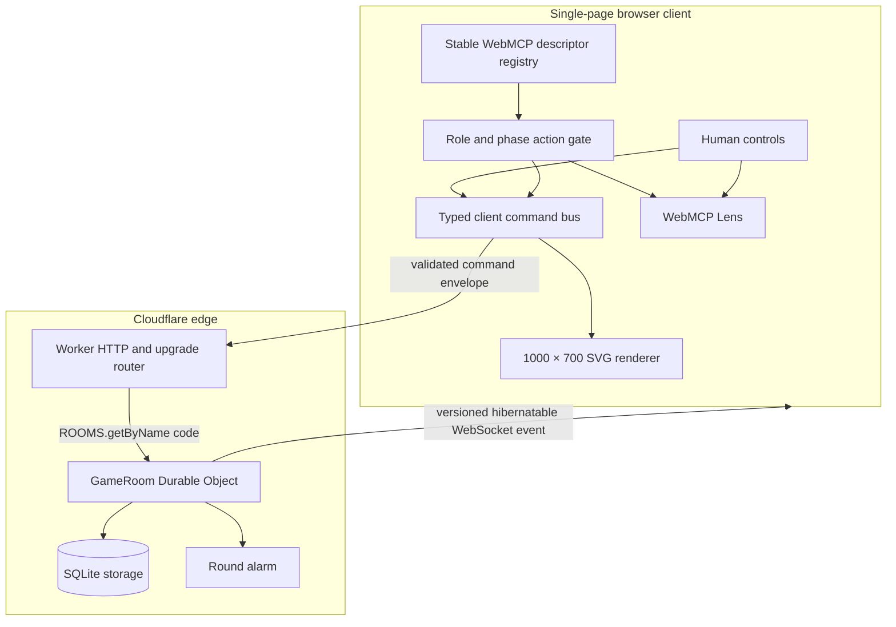
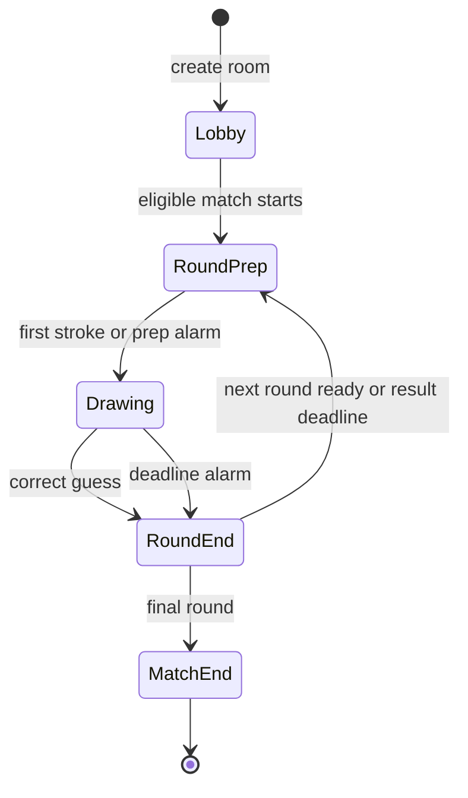
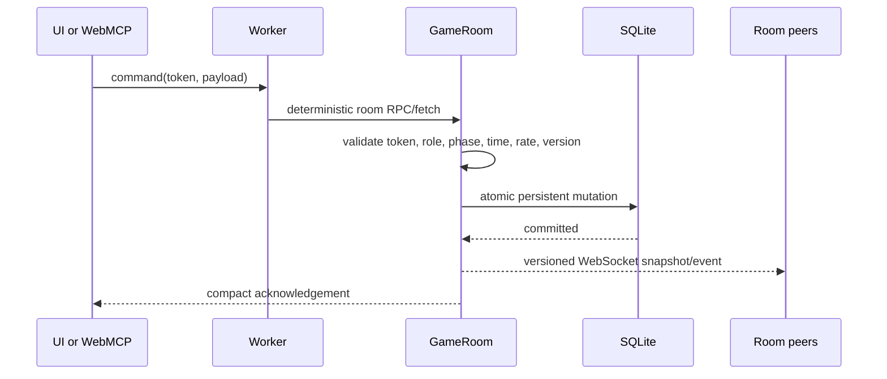
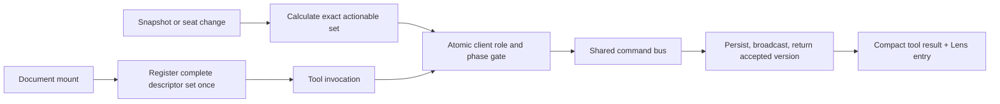

# MCPencil architecture

## Design goal

MCPencil treats a human pointer and a browser agent's WebMCP call as two controllers for one authoritative multiplayer protocol. The browser never decides who may draw, whether a guess is correct, or when a round ends. It renders the latest version accepted by the room authority.

## Coordination atom

One `GameRoom` Durable Object owns one five-character room code. The Worker derives the stub with `ROOMS.getByName(roomCode)`, which provides deterministic routing and serializes concurrent room mutations. Separate rooms do not share a global coordinator.

The Durable Object uses SQLite-backed storage. Its constructor initializes schema only; request work is not wrapped in `blockConcurrencyWhile`. Critical mutations are committed before the in-memory snapshot is changed or a broadcast is sent. A reconstructed instance can recover the room from storage after eviction or deployment.

One Durable Object alarm represents the current round deadline. Starting or advancing a round replaces that alarm. The alarm rechecks the persisted round identity and deadline before finalizing, so a delayed or superseded alarm cannot end the wrong round.

## State machine

Server invariants:

- `lobby`: no prompt is accessible; only readiness, seat configuration, and applicable host settings are mutable. Sketch Duet starts automatically after its one human and one agent both connect; eligible competitive rooms require the host to start them.
- `round-prep`: the artist may access the private prompt and send one opening stroke, but guessing is disabled and the configured round clock has not started. An eight-second fallback starts a stalled agent or competitive turn; Sketch Duet's human-artist turn instead clears that alarm and stays private until the human's first stroke.
- `drawing`: exactly one artist exists and `endsAt` is persisted. Only that artist may draw. The eligible guessers are the duet partner, the active artist's non-artist teammates in Team Match, or every other starting player in Free-for-All.
- `round-end`: drawing and guessing are immutable; the answer and full guess transcript are visible for at least eight seconds. All connected players may advance it after that minimum; a 15-second hard deadline advances it automatically.
- `match-end`: scores, analytics, and replay are immutable.

Sketch Duet uses the same phases and command schemas for exactly one human and one agent, alternating roles across a host-selected 2, 4, or 6 rounds. Team Match uses two teams of 2–4 seats, a host-selected 4, 6, or 8 rounds, alternating team turns, and rotating artists. Free-for-All freezes its 3–8-player roster and shuffled artist order at start; every starting player owns exactly one round, so the roster size—not a host round-count setting—determines match length. The host may choose 90, 120, or 150 seconds per round in any lobby, with 90 seconds as the default. Settings and the frozen competitive schedule are persisted and broadcast before play.

Team Match credits `100 + remaining whole seconds` to the active team when a teammate solves the drawing. In Free-for-All, all non-artists may guess simultaneously; the first accepted correct guess ends the round and independently credits that guesser and the artist `100 + remaining whole seconds` each. Individual standings determine the winner, and equal totals remain ties.

## Command lifecycle

Every mutation is a `CommandEnvelope` containing an opaque seat token and a discriminated command. The shared schema rejects unknown keys and invalid payloads at the edge of the trust boundary.

The acknowledgement follows persistence and the server's broadcast step and contains the authoritative version accepted by the room. Rendering is asynchronous on each receiving client, so the acknowledgement is not evidence that every browser has already painted that version.

The command carries an explicit `origin` for drawable and guess actions: `human-ui` or `webmcp`. Origin is analytics data and is checked against the seat's declared controller type, never used as the source of authorization. Both origins hit the identical server handler. Mode, roster, role, and phase determine guess eligibility. This label is not cryptographic attestation of a model, browser surface, or unmodified client.

## Canonical vector model

The visual SVG view box is `1000 × 700`. The drawing protocol validates horizontal coordinates and shape extents against `x=0..1000` and vertical coordinates and extents against `y=0..700`, so an accepted primitive cannot exist only outside the visible canvas. Rendering scales the same canonical geometry uniformly to desktop, phone, and video layouts.

Allowed primitives:

- line;
- polyline (2–48 points);
- ellipse;
- rectangle with optional corner radius;
- circular arc;
- polygon (3–24 points).

Each primitive uses an enumerated palette and stroke width, with an optional enumerated fill. The public `draw_stroke` WebMCP tool accepts exactly one primitive and generates a bounded idempotency key. The shared internal drawing command can represent human UI work, but the room rejects every WebMCP-origin mutation whose primitive count is not exactly one before persistence. Arbitrary SVG paths, markup, text, URLs, images, filters, event attributes, and external references never enter the renderer.

The persisted canvas event stream is canonical. Live rendering, reconnect catch-up, replay, stroke counts, and analytics derive from those events rather than independent client state. Each agent tool acknowledgement follows its corresponding persistence and broadcast step, and undo removes the caller's last accepted stroke. A receiving client may paint the broadcast after the caller has received the acknowledgement.

## Realtime and reconnects

The room accepts WebSockets through the Durable Object hibernation API. The browser WebSocket API cannot set an `Authorization` header, so the client currently supplies the opaque seat token in the TLS-protected handshake query. The Worker transfers it to an internal header for room authorization; the Durable Object serializes only the resulting seat ID into connection attachment data and never persists the raw token. Application logs must not record handshake URLs. A short-lived, single-purpose socket ticket would further reduce exposure in intermediary access logs and remains release hardening. The room can survive idle periods without billing for a continuously live isolate.

Broadcasts carry monotonically increasing room revisions and canvas versions. Clients ignore older data. After a disconnect, a client authenticates again, reports the last applied version, and receives either missing events or a canonical snapshot. Timers continue while no clients are connected.

## Stable WebMCP registry and dynamic action gate

The app uses the imperative `document.modelContext.registerTool` API. It registers the complete semantic descriptor set once for the document lifetime. It does not unregister and recreate descriptors on every role transition, which keeps long matches compatible with browser and agent surfaces that impose a finite tool-configuration-change budget.

Tool descriptors provide discoverability, not authorization. From each role-safe snapshot and caller seat, the client atomically computes the exact tools actionable now; every handler rejects a call outside that set before work begins, and the Lens displays that set rather than pretending the stable registry was replaced. Invocation execution signals cancel pending waits and requests. The room authority independently validates the current token, seat, role, phase, deadline, rate, round, and canvas version, so a stale or manually invoked descriptor cannot cross a transition boundary. `get_match_state` remains role-safe and includes the private prompt only for the authenticated active agent artist. An eligible agent guesser instead receives recent guesses, a deterministic `32 × 22` topmost-color text raster, and a bounded summary of the same canonical primitives rendered on screen. The agent's isolated browser document supplies the primary visual picture; the raster is a fast text-client fallback and geometry is a final cross-check. None contains semantic answer data, so this remains a transparent hybrid rather than a claimed pixel-only benchmark. Artist calls to `draw_stroke` are serialized locally and version-chained; the Worker independently enforces the one-primitive invariant.

Agent pacing guidance requests a simple outline first and consecutive acknowledged drawing strokes without redundant screenshots, state reads, or narration. Active agent guesser waits are capped at two seconds, while idle/transition waits retain the 25-second ceiling and wake immediately on authoritative updates. A retry may make visually supported or close-feedback refinements without waiting for another stroke, but must not repeat recent guesses; if none are plausible, the agent briefly waits again. The prior visual is reusable only when `canvasVersion` matches the last observed picture, not merely the latest acknowledgement; material scene changes require fresh visual inspection. These are pacing and guidance changes, not a visual cache or a relaxation of role, privacy, rate, or acknowledgement rules.

Production agent links use `agent.mcpencil.com`, served by the same Worker and room Durable Objects but separated from the human site by origin, document, `sessionStorage`, COOP, and origin policy. This lets the browser agent visually inspect its synchronized canvas without ever observing a human artist's private-prompt DOM. A `play_mcpencil` call from an already seated human document fails closed and returns the exact separate agent URL.

Sketch Duet is one authoritative two-seat room represented by two isolated browser documents. The human creates a waiting one-seat room, then the zero-context `play_mcpencil` entry tool joins from `agent.mcpencil.com` and returns a distinct opaque agent credential. The room starts only after both authenticated WebSockets connect. Human controls send the human token with `human-ui` origin; page tool handlers in the agent document send the agent token with `webmcp` origin. The backend authorizes them as separate identities and alternates the artist between them. Because controller type is declared at join time, the origin field records the intended path but cannot cryptographically prove that a modified client did not imitate it.

Tool outputs are concise and structured. Player-created names and guesses are labeled untrusted content. Tool descriptions explain when a call is appropriate but do not echo user-authored content into instructions.

## Prompt secrecy

The answer is server-owned and is not a property of the shared `RoomSnapshot`. During a prepared or drawing phase it may leave the room only through a role-safe active-artist response after token, seat, round, phase, and artist checks. In every mode, a human artist reveal occupies a private UI subtree while every agent's `submit_guesses` action remains unauthorized. The human must explicitly memorize and hide the card; React unmounts the answer, and the first visible stroke starts the clock and enables guessing. The production agent document lives on a separate origin and never renders the human prompt.

The following surfaces are explicitly prompt-free until round end:

- shared HTTP state;
- WebSocket snapshots and presence events;
- canvas events;
- guess events;
- activity/Lens details;
- replay records;
- structured application logs;
- error strings and tool acknowledgements.

At round end, the revealed answer is stored only in the round result intended for all players.

## Hosting and headers

Cloudflare Workers serves the built Vite assets and routes `/api/*` and `/ws/*` through the Worker first. Production uses `https://mcpencil.com` and `https://www.mcpencil.com`, with the generated `workers.dev` hostname retained as a diagnostic fallback.

Security headers include:

- `Content-Security-Policy` with no inline script or cross-origin embedding needs;
- `Permissions-Policy: tools=(self)`;
- `Origin-Agent-Cluster: ?1`;
- `X-Content-Type-Options: nosniff`;
- a restrictive referrer policy and frame policy.

No model key, OpenAI API credential, or bot credential exists in the application. The browser agent that visits the site supplies the intelligence.

## Source map

| Area | Responsibility |
|---|---|
| `src/shared` | Zod contracts, shared game types, canvas constants, formatting helpers |
| `src/client` | React UI, SVG interaction/rendering, API/WebSocket client, WebMCP registration and Lens |
| `src/worker` | Worker router, room authority, prompt deck, normalization, persistence, alarms, WebSockets |
| `tests` | Workerd schema/utility tests and Worker/Durable Object integration coverage |
| `docs` | Submission, architecture, threat model, demo, and playtest evidence |

## Operational checks

- `npm run types` regenerates bindings from `wrangler.jsonc`.
- `npm run check` runs type checking, Workerd tests, and the production build.
- Cloudflare observability records structured operational fields but not prompts, raw tokens, or private input.
- The release deployment is smoke-tested through both custom-domain hostnames and the Workers preview URL.
