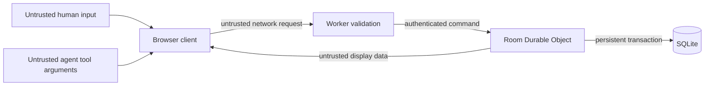

# Threat model

## Scope and security objective

MCPencil is an anonymous, short-lived party game. Its most important integrity property is that only the current artist can learn the answer before a round ends, while only legal participants can mutate the room. Its most important availability property is that one abusive room cannot corrupt or stall other rooms.

This model covers the browser client, imperative WebMCP tools, Worker routes, a per-room Durable Object, SQLite state, hibernatable WebSockets, and Cloudflare-hosted static assets. It does not treat the visiting browser agent, a player's device, or user-authored names/guesses as trusted.

## Assets

| Asset | Required property |
|---|---|
| Active private prompt | Confidential until round end; available only to active artist |
| Seat token | Confidential; possession authenticates one seat |
| Room state and scores | Integrity and consistent ordering |
| Canvas/replay event log | Integrity, bounded resource use, deterministic rendering |
| Player names and guesses | Treated as untrusted data; safe rendering and tool output |
| Room availability | Rate-bounded; isolated from unrelated rooms |
| Lens/activity data | Accurate declared origin without prompt or reasoning leakage |

## Trust boundaries



The stable client descriptor registry is discoverability, not authorization. The client maintains a separate exact actionable set, and all mode, roster, role, phase, time, token, rate, and version checks are repeated inside the authoritative room.

## Threats and controls

### Prompt disclosure

Threats include guessing a private route, joining as another seat, inspecting shared JSON or WebSocket frames, reading replay/activity data, eliciting the answer through an error, or recovering it from logs.

Controls:

- the answer is absent from shared snapshot types and broadcasts;
- the private prompt path verifies the token hash, active seat, artist role, phase, and round;
- raw prompts are never included in activity/Lens entries or application logs;
- generic error codes do not interpolate answers;
- every human-artist round keeps `submit_guesses` non-actionable until the human hides the private card, its answer is unmounted, and the opening stroke begins the timed drawing phase;
- production agents join through a separate `agent.mcpencil.com` origin and document, so browser visual observation cannot include the human artist's private-prompt DOM;
- tests recursively scan every pre-reveal shared payload for the answer and known aliases.

### Seat impersonation or token theft

Threats include room-code enumeration, raw token persistence, reflected tokens, cross-site requests, and accidental logs.

Controls:

- room codes identify routing, not authority;
- seat tokens are generated with Web Crypto and contain at least 256 bits of entropy;
- only cryptographic token hashes are persisted;
- ordinary HTTP API calls use bearer authorization and do not place tokens in URLs;
- the browser WebSocket constructor cannot set a bearer header, so the current WSS handshake includes the seat token in its TLS-protected query; the Worker transfers it to an internal header, and the Durable Object persists only the token hash and attaches only the seat ID to the accepted socket;
- responses disable cross-origin tool exposure and framing;
- application code does not log authorization values or handshake URLs;
- comparison uses fixed-size digests.

Residual risks: intermediary access logging can capture a WebSocket request URL, and a malicious script or extension with access to browser storage can act as that seat. Before a higher-risk public deployment, replace the query credential with a short-lived, single-purpose socket ticket and verify edge-log redaction. Account-based recovery is deliberately outside the anonymous-game scope.

### Sketch Duet invitation capture

Threats include enumerating or forwarding a five-character room code and claiming the complementary Sketch Duet seat before the intended agent joins.

Controls and limits:

- the code locates an invite-only room but grants no authority over an existing seat;
- Sketch Duet admits exactly two seats and requires one declared human controller and one declared agent controller;
- every joined seat receives a distinct high-entropy credential, and subsequent actions require that credential;
- this release does not sign the invitation or authenticate which agent should claim the open seat.

The remaining-seat race is accepted for short-lived challenge rooms, not described as strong admission security. Signed, one-use agent invitations plus join-rate monitoring are future hardening.

### Prompt injection through player content

Threats include a player name or guess that tells the agent to ignore rules, reveals fake tool instructions, or injects markup.

Controls:

- names and guesses are length-limited strings and never interpreted as instructions;
- React text rendering is used; no `dangerouslySetInnerHTML` path accepts player content;
- tool results containing player content carry `untrustedContentHint`;
- tool descriptions are static and do not interpolate names or guesses;
- the Lens labels player text as data and truncates safe summaries.

### Malicious geometry and SVG injection

Threats include scripts in SVG, external URLs, huge path strings, extreme coordinates, degenerate payloads, or enough points to freeze clients.

Controls:

- strict discriminated Zod schemas accept only six primitive types and reject unknown keys;
- coordinates, dimensions, widths, colors, point counts, and request sizes are bounded, and WebMCP-origin drawing mutations must contain exactly one primitive;
- no arbitrary path/markup/text/URL/image field exists;
- renderers create known React SVG elements from numeric data;
- the room revalidates the canvas height constraint and payload budget;
- drawing calls are rate-limited per seat.

### Replay, duplicates, and races

Threats include duplicated agent calls, replayed requests, stale clients overwriting newer drawings, or writes arriving after the timer.

Controls:

- each `draw_stroke` call receives a bounded generated idempotency key with per-round uniqueness;
- the room returns the previous compact acknowledgement for a duplicate key;
- mutations require the expected canvas version;
- the Durable Object serializes room commands;
- each mutating path checks the persisted deadline before committing;
- the alarm rechecks round identity and phase before finalization;
- state persists before broadcasting.

### Guess abuse and answer probing

Threats include high-rate dictionary guesses, a mode-ineligible guess, an artist self-guess, concurrent correct guesses, and alias/typo matching used as an oracle.

Controls:

- the room derives eligibility from the persisted mode and roster: the duet partner, active-team non-artists in Team Match, or every non-artist starting player in Free-for-All;
- the Durable Object serializes simultaneous guesses, so only the first accepted correct guess ends the round and receives solver credit; Free-for-All credits the artist in the same authoritative mutation;
- per-seat monotonic rate limits bound attempts;
- rejected guesses reveal no distance or alias detail;
- comparisons are server-side against curated per-card aliases;
- guesses remain length-bounded and wrong answers have a generic result.

### Cross-room interference and denial of service

Threats include a global coordinator bottleneck, oversized rooms, connection floods, event-log growth, and malformed WebSocket frames.

Controls:

- one deterministically named Durable Object owns each room;
- room seats, message sizes, vector operations, points, guesses, and action frequency are capped;
- WebSocket messages use a small fixed protocol and invalid frames close cleanly;
- completed room retention and replay size are bounded;
- static assets are served at the edge;
- errors are isolated per request and do not use pass-through exception handling.

### Stable tool descriptor confused deputy

Threats include invoking the stable artist descriptor after rotation or an in-flight call committing in the next phase.

Controls:

- the complete semantic descriptor registry is attached once for the document lifetime, avoiding repeated configuration changes without presenting descriptors as permissions;
- every role/phase update atomically recomputes the exact actionable set, and each handler rejects calls outside that set before work begins;
- invocation execution signals cancel pending client network and long-poll work;
- server authorization is based on current persisted state, never on the descriptor registry or Lens set;
- round and expected-version checks prevent cross-phase commits;
- tests assert one stable registration pass, the exact actionable set for each role/phase, and rejection of stale direct invocations.

### Provenance spoofing

Threats include a modified client declaring an agent controller and submitting `origin: webmcp` without using a page-registered tool, or declaring a human controller while automating UI requests.

Controls and limits:

- the server binds a controller type to each seat and rejects command origins that do not match that declaration;
- role, phase, token, time, rate, round, and version authorization never depends on the origin label;
- the Lens and analytics report declared command origin without claiming model identity or cryptographic attestation;
- no release mechanism proves that a particular model, browser feature, or unmodified tool handler produced the request.

This is sufficient for transparent party-game analytics, not forensic provenance. Submission materials must call these labels declared origin, and any future competitive benchmark should add an attested channel before treating them as proof.

## Privacy and logging

MCPencil requires no account, email, model credential, microphone, camera, upload, or geolocation. Persisted data is limited to room lifecycle, hashed seat credentials, display names, controller labels, vector operations, guesses, scores, and public round results.

Structured operational logs may include route, status, room code or a room-code hash, phase, duration, safe error code, and canvas/revision numbers. They must exclude active prompts, raw seat tokens, full request bodies, WebSocket handshake URLs, WebSocket attachment credentials, and player-authored free text. Raw room codes currently identify short-lived invite rooms; hashing them before the release freeze would further reduce avoidable correlation in retained logs.

## Security headers release check

For both `mcpencil.com` and `www.mcpencil.com`, verify:

```text
Content-Security-Policy
Permissions-Policy: tools=(self)
Origin-Agent-Cluster: ?1
X-Content-Type-Options: nosniff
Referrer-Policy
X-Frame-Options or CSP frame-ancestors
```

Also confirm HTTPS-only access, no mixed content, no source map containing private data, no secrets in the production bundle, and no cross-origin WebMCP registration.

## Out of scope for the challenge release

- compromised client operating systems, browser extensions, or agent providers;
- user moderation beyond small invite-code rooms and content length limits;
- long-term identity, account recovery, or regulated personal-data workflows;
- protection against a player photographing another player's private prompt;
- massive public broadcasting or adversarial internet-scale rooms.

## Incident response

If a prompt leak or authorization failure is found, pause new room creation, retain sanitized diagnostics, deploy the smallest fix, invalidate all active anonymous rooms by schema/protocol version, rerun the secrecy suite and judge path, then document the remediation in the repository before re-enabling play.
