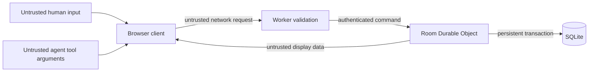

# Threat model

## Scope and security objective

MCPencil is an anonymous, short-lived party game. Its most important integrity property is that only the current artist can learn the answer before a round ends, while only legal participants can mutate the room. Its most important availability property is that one abusive room cannot corrupt or stall other rooms.

This model covers the browser client, imperative WebMCP tools, Worker routes, a per-room Durable Object, SQLite state, hibernatable WebSockets, and Cloudflare-hosted static assets. It does not treat the visiting browser agent, a player's device, or user-authored names/guesses as trusted.

## Assets

| Asset | Required property |
|---|---|
| Active private prompt | Confidential until round end; available only to active artist |
| Seat token | Confidential; possession authenticates one seat |
| Room state and scores | Integrity and consistent ordering |
| Canvas/replay event log | Integrity, bounded resource use, deterministic rendering |
| Player names and guesses | Treated as untrusted data; safe rendering and tool output |
| Room availability | Rate-bounded; isolated from unrelated rooms |
| Lens/activity data | Honest provenance without prompt or reasoning leakage |

## Trust boundaries



Client-side tool availability is guidance, not authorization. All role, phase, team, time, token, rate, and version checks are repeated inside the authoritative room.

## Threats and controls

### Prompt disclosure

Threats include guessing a private route, joining as another seat, inspecting shared JSON or WebSocket frames, reading replay/activity data, eliciting the answer through an error, or recovering it from logs.

Controls:

- the answer is absent from shared snapshot types and broadcasts;
- the private prompt path verifies the token hash, active seat, artist role, phase, and round;
- raw prompts are never included in activity/Lens entries or application logs;
- generic error codes do not interpolate answers;
- Practice round two withholds `submit_guesses` until the human hides the private card, its answer is unmounted, and the opening stroke begins the timed drawing phase;
- tests recursively scan every pre-reveal shared payload for the answer and known aliases.

### Seat impersonation or token theft

Threats include room-code enumeration, raw token persistence, reflected tokens, cross-site requests, and accidental logs.

Controls:

- room codes identify routing, not authority;
- seat tokens are generated with Web Crypto and contain at least 256 bits of entropy;
- only cryptographic token hashes are persisted;
- tokens are supplied outside URLs and never returned after initial seat creation/join;
- responses disable cross-origin tool exposure and framing;
- logs exclude authorization values;
- comparison uses fixed-size digests.

Residual risk: a malicious script or extension with access to the player's browser storage can act as that seat. Account-based recovery is deliberately outside the anonymous-game scope.

### Prompt injection through player content

Threats include a player name or guess that tells the agent to ignore rules, reveals fake tool instructions, or injects markup.

Controls:

- names and guesses are length-limited strings and never interpreted as instructions;
- React text rendering is used; no `dangerouslySetInnerHTML` path accepts player content;
- tool results containing player content carry `untrustedContentHint`;
- tool descriptions are static and do not interpolate names or guesses;
- the Lens labels player text as data and truncates safe summaries.

### Malicious geometry and SVG injection

Threats include scripts in SVG, external URLs, huge path strings, extreme coordinates, degenerate payloads, or enough points to freeze clients.

Controls:

- strict discriminated Zod schemas accept only six primitive types and reject unknown keys;
- coordinates, dimensions, widths, colors, point counts, and request sizes are bounded, and WebMCP-origin drawing mutations must contain exactly one primitive;
- no arbitrary path/markup/text/URL/image field exists;
- renderers create known React SVG elements from numeric data;
- the room revalidates the canvas height constraint and payload budget;
- drawing calls are rate-limited per seat.

### Replay, duplicates, and races

Threats include duplicated agent calls, replayed requests, stale clients overwriting newer drawings, or writes arriving after the timer.

Controls:

- each `draw_stroke` call receives a bounded generated idempotency key with per-round uniqueness;
- the room returns the previous compact acknowledgement for a duplicate key;
- mutations require the expected canvas version;
- the Durable Object serializes room commands;
- each mutating path checks the persisted deadline before committing;
- the alarm rechecks round identity and phase before finalization;
- state persists before broadcasting.

### Guess abuse and answer probing

Threats include high-rate dictionary guesses, non-teammate guesses, an artist self-guess, and alias/typo matching used as an oracle.

Controls:

- only connected active-team non-artists may submit;
- per-seat monotonic rate limits bound attempts;
- rejected guesses reveal no distance or alias detail;
- comparisons are server-side against curated per-card aliases;
- guesses remain length-bounded and wrong answers have a generic result.

### Cross-room interference and denial of service

Threats include a global coordinator bottleneck, oversized rooms, connection floods, event-log growth, and malformed WebSocket frames.

Controls:

- one deterministically named Durable Object owns each room;
- room seats, message sizes, vector operations, points, guesses, and action frequency are capped;
- WebSocket messages use a small fixed protocol and invalid frames close cleanly;
- completed room retention and replay size are bounded;
- static assets are served at the edge;
- errors are isolated per request and do not use pass-through exception handling.

### Tool lifecycle confused deputy

Threats include an old artist tool remaining callable after rotation or an in-flight call committing in the next phase.

Controls:

- every role/phase change removes the obsolete registration scope;
- removing a registration is not assumed to terminate an executing invocation;
- invocation execution signals and captured-generation checks protect pending network/ack waits and local results;
- server authorization is based on current persisted state, never on the client tool set;
- round and expected-version checks prevent cross-phase commits;
- tests assert the exact registered tool set for each role/phase.

## Privacy and logging

MCPencil requires no account, email, model credential, microphone, camera, upload, or geolocation. Persisted data is limited to room lifecycle, hashed seat credentials, display names, controller labels, vector operations, guesses, scores, and public round results.

Structured operational logs may include route, status, room-code hash, phase, duration, safe error code, and canvas/revision numbers. They must exclude active prompts, raw seat tokens, full request bodies, WebSocket attachment credentials, and player-authored free text.

## Security headers release check

For both `mcpencil.com` and `www.mcpencil.com`, verify:

```text
Content-Security-Policy
Permissions-Policy: tools=(self)
Origin-Agent-Cluster: ?1
X-Content-Type-Options: nosniff
Referrer-Policy
X-Frame-Options or CSP frame-ancestors
```

Also confirm HTTPS-only access, no mixed content, no source map containing private data, no secrets in the production bundle, and no cross-origin WebMCP registration.

## Out of scope for the challenge release

- compromised client operating systems, browser extensions, or agent providers;
- user moderation beyond small invite-code rooms and content length limits;
- long-term identity, account recovery, or regulated personal-data workflows;
- protection against a player photographing another player's private prompt;
- massive public broadcasting or adversarial internet-scale rooms.

## Incident response

If a prompt leak or authorization failure is found, pause new room creation, retain sanitized diagnostics, deploy the smallest fix, invalidate all active anonymous rooms by schema/protocol version, rerun the secrecy suite and judge path, then document the remediation in the repository before re-enabling play.
